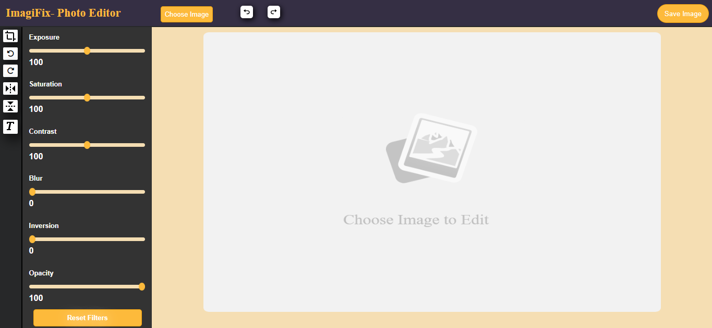
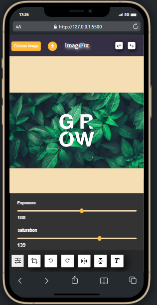

# 🎨 ImagiFix — Photo Editing Web App

<div align="center">
  
</div>

ImagiFix is a Canvas-based photo editor built with **pure HTML5, CSS3 and Vanilla
JavaScript (ES modules)** — **zero libraries, frameworks, build tools or CDNs**.
It runs fully offline as a Progressive Web App.

> This codebase is a deliberate demonstration of modern frontend engineering
> *without* tooling: a one-way data-flow architecture, a rAF-batched canvas
> render pipeline, lightweight undo/redo, and an accessible, responsive UI —
> all hand-rolled.

🔗 **Live demo:** https://imagi-fix.vercel.app

---

## ✨ Features

| | Feature | Notes |
|---|---|---|
| 🎚️ | **Adjustments** | Exposure, saturation, contrast, blur, inversion, opacity |
| ✂️ | **Crop** | Drag-select on canvas (mouse **or** touch via Pointer Events) |
| 🔄 | **Rotate** | 90° left / right |
| 🪞 | **Flip** | Horizontal / vertical |
| 🅰️ | **Text overlay** | Live draggable overlay — colour & size, reopen any time to reposition, Done / Cancel |
| ↩️ | **Undo / Redo** | Lightweight state snapshots, not pixel buffers |
| 💾 | **Save** | Exports a PNG of the exact composited result |
| 📲 | **PWA** | Installable, works offline, smart caching |
| ⌨️ | **Shortcuts** | `Ctrl+Z/Y` undo/redo · `Ctrl+S` save · `R`/`Shift+R` rotate · `H`/`V` flip · `Esc` cancel |

---

## 🏗️ Architecture

State flows **one way**: features dispatch to a single observable **store**, the
store notifies subscribers, and a **rAF-coalesced render pipeline** repaints the
canvas. Nothing reaches into anything else.

```
UI event ──▶ feature ──▶ store.setState() ──▶ subscribers ──▶ renderer.scheduleRender()
                                   │                                     │
                                   └────────── history snapshot ◀────────┘
```

### Project layout

```
ImagiFix/
├── index.html                  # semantic markup, ARIA, data-icon slots, <script type="module">
├── manifest.webmanifest
├── sw.js                       # service worker: precache + stale-while-revalidate
├── assets/
│   ├── icons.js                # inline SVG icon registry (replaces icon CDNs)
│   └── images/                 # logos + placeholder
├── css/                        # ITCSS-ish: base / layout / components, single @import entry
│   ├── main.css
│   ├── base/      tokens · reset · typography
│   ├── layout/    header · editor · sidebar · toolbar · canvas
│   └── components/ buttons · range · text-overlay · install-popup · toast
└── js/
    ├── main.js                 # bootstrap & wiring only
    ├── config/constants.js     # filters, defaults, shortcuts, breakpoints
    ├── core/                   # store · eventBus · state (the spine)
    ├── canvas/                 # renderer · filters · geometry (pure paint pipeline)
    ├── features/               # imageIO · transform · crop · text · filtersPanel · history
    ├── ui/                     # dom · controls · shortcuts · responsive · toast
    ├── pwa/                    # service-worker registration + install prompt
    └── utils/helpers.js        # debounce · throttle · rafThrottle · clamp · downloadBlob
```

### Design decisions worth a look

- **Single source of truth** — [`core/store.js`](js/core/store.js): an observable
  store with shallow change-detection (no-op updates don't repaint).
- **Pure render pipeline** — [`canvas/renderer.js`](js/canvas/renderer.js): the
  same `paint()` function drives the live canvas *and* PNG export, so the saved
  file can never drift from the preview.
- **Config-driven UI** — the adjustment sliders are generated from the `FILTERS`
  table in [`config/constants.js`](js/config/constants.js). Add a filter there and
  it appears in the panel, the render pipeline and reset/undo automatically.
- **Cheap history** — [`features/history.js`](js/features/history.js) snapshots
  *state* (a few numbers + objects), not full `ImageData` buffers.
- **Pointer Events** — one code path for mouse and touch in
  [`features/crop.js`](js/features/crop.js).
- **Zero dependencies** — icons are inline SVG, fonts are a system stack;
  nothing is fetched from a CDN, so the PWA is genuinely offline-first.

---

## ⚡ Performance

- Paint work is coalesced to one repaint per animation frame (`rafThrottle`).
- The canvas uses the GPU-accelerated path (no per-edit `getImageData` readbacks).
- Images decode off the main thread via `createImageBitmap` (with a safe fallback
  that revokes its object URL).
- The service worker precaches the app shell and serves it stale-while-revalidate.

---

## ♿ Accessibility

Semantic landmarks, `aria-label`/`aria-pressed` on icon controls, visible
`:focus-visible` rings, an `aria-live` status region for feedback, full keyboard
shortcuts, and `prefers-reduced-motion` support.

---

## 🚀 Running locally

ES modules and the service worker must be served over HTTP (not `file://`).
**No build step or install required** — any static server works:

```bash
# Python (built in on macOS/Linux)
python3 -m http.server 8000

# …or Node's one-liner
npx serve .
```

Then open <http://localhost:8000>.

---

## 🛠️ Built with

Pure **HTML5 · CSS3 · Vanilla JavaScript (ES2020 modules)** and the **Canvas 2D**,
**Pointer Events**, **Service Worker** and **Web App Manifest** browser APIs.
No libraries. No frameworks. No bundler.

## 📷 Preview

### Desktop


### Mobile
<div align="center">
  
</div>
