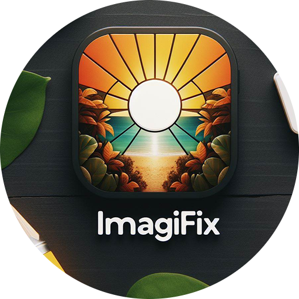

# ImagiFix--Photo Editing Web App

  

ImagiFix is a robust photo editing web application built using HTML,CSS,Canvas API, and Vanilla JavaScript.The application is designed to work offline as a Progressive Web App (PWA), enhancing its usability and accessibility.

## Features

The application provides a variety of features for editing the photos:

1. **Filters**:
 Apply different filters to your images, including brightness, saturation, contrast, blur, inversion, and opacity.

2. **Crop Image**:
 Trim your images to the perfect size.

3. **Rotate Image**: 
Rotate your images to the right or left as needed.

4. **Flip Image**:
 Flip your images horizontally or vertically.

5. **Add Text Overlay**: 
Add a text overlay to your images for additional context or creativity.

6. **Reset, Undo & Redo**:
Easily revert changes using the reset, undo, and redo buttons.

7. **Save Image**: 
Save your edited images directly from the application.

## Built With Pure JavaScript

This application is built using pure JavaScript, without the use of any libraries or frameworks.This approach demonstrates the power and flexibility of Vanilla JS in creating complex applications.

## Application Preview

Here are some screenshots of the application in action:

### Desktop View

### Mobile View

## Usage
- Choose an image using the Choose Image Button.
- Apply various filters and manipulate the image as needed.
- Add text overlay if desired.
- Save the edited image to your device either right clicking on the canvas or using the Save image button.

## Live Demo
[Visit the ImagiFix-Photo Editing Web App](https://imagi-fix.vercel.app)

